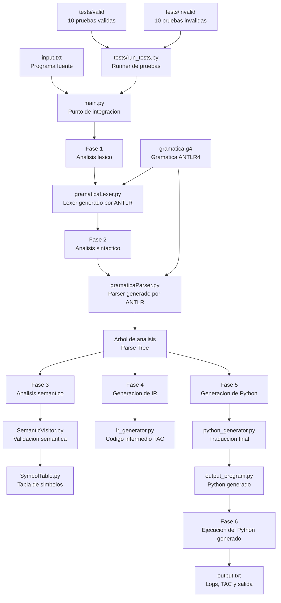

# Mini-compilador: Lenguaje de expresiones logicas complejas

## 1. Descripcion general del proyecto

Este proyecto implementa un mini-compilador para un lenguaje de expresiones logicas booleanas. El lenguaje permite declarar variables booleanas, construir expresiones logicas complejas con `AND`, `OR`, `NOT`, usar parentesis para agrupar operaciones y mostrar resultados mediante `print`.

El compilador demuestra las fases principales del proceso de construccion de compiladores:

1. Analisis lexico.
2. Analisis sintactico.
3. Analisis semantico con tabla de simbolos.
4. Generacion de codigo intermedio.
5. Traduccion a Python.
6. Ejecucion del codigo Python generado.

## 2. Estructura del proyecto

```txt
MiniCompiladorFinal/
|-- main.py
|-- input.txt
|-- output_program.py
|-- output.txt
|-- gramatica.g4
|-- semantic_analyzer/
|   |-- SymbolTable.py
|   |-- SemanticVisitor.py
|   |-- __init__.py
|-- generated/
|   |-- gramaticaLexer.py
|   |-- gramaticaParser.py
|   |-- gramaticaListener.py
|   |-- gramaticaVisitor.py
|   |-- ...
|-- codegen/
|   |-- ir_generator.py
|   |-- python_generator.py
|   |-- __init__.py
|-- tests/
|   |-- valid/
|   |-- invalid/
|   |-- run_tests.py
```

Responsabilidades principales:

- `main.py`: integra todas las fases del compilador.
- `input.txt`: contiene el programa fuente principal que se desea compilar.
- `output_program.py`: contiene el codigo Python generado automaticamente.
- `output.txt`: guarda logs, codigo intermedio y salida del programa generado.
- `gramatica.g4`: define la gramatica ANTLR4 del lenguaje.
- `semantic_analyzer/`: contiene la tabla de simbolos y las reglas semanticas.
- `generated/`: contiene los archivos generados por ANTLR4.
- `codegen/`: contiene los generadores de codigo intermedio y Python.
- `tests/`: contiene 10 pruebas validas, 10 invalidas y el script de ejecucion.

## 3. Diseno del lenguaje y la gramatica

El lenguaje fue disenado para trabajar exclusivamente con valores booleanos. Su objetivo es permitir expresiones logicas complejas, pero manteniendo una sintaxis pequena y clara.

Caracteristicas del lenguaje:

- Asignacion de variables booleanas.
- Literales booleanos `TRUE` y `FALSE`.
- Operadores logicos `AND`, `OR` y `NOT`.
- Agrupacion mediante parentesis.
- Impresion de variables con `print(ID);`.

Ejemplo:

```txt
a = TRUE;
b = FALSE;
c = a AND NOT b;
print(c);
```

Gramatica base:

```antlr
program : statement+ EOF ;
statement : assignment | printStmt ;
assignment : ID '=' boolExpr ';' ;
boolExpr : boolTerm (('AND' | 'OR') boolTerm)* ;
boolTerm : 'NOT'? (ID | 'TRUE' | 'FALSE' | '(' boolExpr ')') ;
printStmt : 'print' '(' ID ')' ';' ;
```

En la implementacion se incluyo tambien el token `NUMBER` para detectar semanticamente casos como `a = 1;`. La idea es que el parser pueda reconocer el numero, pero el analizador semantico lo rechace porque el lenguaje solo acepta booleanos.

## 4. Decisiones tomadas por fase

### Fase lexica

Se definieron tokens para las palabras reservadas y simbolos principales:

```txt
TRUE, FALSE, AND, OR, NOT, print, ID, NUMBER, =, ;, (, )
```

Decision tomada:

- `AND`, `OR` y `NOT` se escriben como palabras reservadas en mayuscula para diferenciarlas claramente de los identificadores.
- `print` se mantiene en minuscula para parecerse a Python.
- Los espacios, saltos de linea y comentarios se ignoran durante el analisis lexico.

### Fase sintactica

La sintaxis se organizo alrededor de dos tipos de sentencias:

- Asignaciones: `ID = boolExpr;`
- Impresiones: `print(ID);`

Decision tomada:

- `print` solo recibe identificadores, no expresiones directas. Esto simplifica la semantica y obliga a que los resultados se guarden primero en variables.
- Los parentesis se usan para permitir expresiones anidadas.

### Fase semantica

La semantica esta implementada en `semantic_analyzer/SemanticVisitor.py` y usa `semantic_analyzer/SymbolTable.py`.

Reglas semanticas:

- Toda variable debe ser booleana.
- Una variable debe estar declarada antes de usarse.
- `print` solo puede imprimir variables previamente declaradas.
- Los operadores logicos solo aceptan valores booleanos.
- Los valores numericos se rechazan como error semantico.

Decision tomada:

- La tabla de simbolos guarda cada variable con tipo `bool`.
- Si aparece un identificador no declarado, se genera un error semantico explicativo.
- Si aparece un numero, se genera el error: `Semantic Error: Numeric values are not boolean.`

### Fase de generacion de codigo intermedio

La generacion de codigo intermedio esta en `codegen/ir_generator.py`.

Se genera codigo de tres direcciones usando temporales:

```txt
a = TRUE
b = FALSE
t1 = NOT b
t2 = a AND t1
c = t2
PRINT c
```

Decision tomada:

- Las operaciones compuestas se dividen en pasos simples con temporales `t1`, `t2`, etc.
- Esto facilita ver como se descompone la expresion logica antes de traducirla a Python.

### Fase de generacion de codigo Python

La traduccion final esta en `codegen/python_generator.py`.

Equivalencias:

```txt
TRUE  -> True
FALSE -> False
AND   -> and
OR    -> or
NOT   -> not
print(x); -> print(x)
```

Ejemplo generado:

```python
a = True
b = False
c = (a and (not b))
print(c)
```

Decision tomada:

- Se usan parentesis en la salida para conservar con claridad la agrupacion logica.
- El codigo generado se guarda en `output_program.py`.
- `main.py` ejecuta automaticamente el Python generado y guarda la salida en `output.txt`.

## 5. Ejemplos de uso

### Ejemplo valido

Archivo `input.txt`:

```txt
a = TRUE;
b = FALSE;
c = a AND NOT b;
print(c);
```

Salida esperada:

```txt
True
```

Codigo Python generado:

```python
a = True
b = False
c = (a and (not b))
print(c)
```

### Ejemplo invalido por operador incorrecto

```txt
a = TRUE && FALSE;
print(a);
```

Resultado:

```txt
[Lexical Error] at 1:9: token recognition error at: '&'
```

### Ejemplo invalido por tipo no booleano

```txt
a = 1;
print(a);
```

Resultado:

```txt
Semantic Error: Numeric values are not boolean.
```

## 6. Casos de prueba

El proyecto incluye 20 pruebas:

- 10 pruebas validas en `tests/valid/`.
- 10 pruebas invalidas en `tests/invalid/`.

Las pruebas validas verifican:

- Asignaciones booleanas simples.
- Uso de `AND`, `OR` y `NOT`.
- Expresiones anidadas con parentesis.
- Uso de variables previamente declaradas.
- Impresion de resultados booleanos.

Las pruebas invalidas verifican:

- Operadores no permitidos como `&&` o `XOR`.
- Variables no declaradas.
- Numeros usados como booleanos.
- Parentesis sin cerrar.
- Sentencias incompletas.
- Uso incorrecto de `print`.

Para ejecutar las pruebas:

```powershell
python tests\run_tests.py
```

## 7. Diagrama Mermaid de la arquitectura



## 8. Problemas encontrados y soluciones

### Problema 1: el proyecto original tenia otro lenguaje

El codigo inicial estaba orientado a flujos de trabajo con tareas, transiciones, `input`, `if` y `while`.

Solucion:

- Se reemplazo la gramatica por el lenguaje de expresiones logicas.
- Se conservaron las mismas carpetas y responsabilidades del proyecto original.
- Se ajustaron los modulos semanticos y de generacion de codigo al nuevo lenguaje.

### Problema 2: faltaba el runtime de ANTLR para Python

Al ejecutar `main.py`, aparecia:

```txt
ModuleNotFoundError: No module named 'antlr4'
```

Solucion:

Se instalo el paquete requerido:

```powershell
python -m pip install antlr4-python3-runtime==4.13.1
```

### Problema 3: distinguir errores sintacticos de errores semanticos

El lenguaje solo acepta booleanos, pero una prueba como `a = 1;` debia demostrar error por variable no booleana.

Solucion:

- Se permitio `NUMBER` dentro de la gramatica.
- Luego, el analizador semantico rechaza el numero con un mensaje claro.

### Problema 4: las pruebas solo mostraban PASS

El runner inicial solo indicaba si una prueba pasaba o fallaba.

Solucion:

- Se modifico `tests/run_tests.py` para mostrar tambien el resultado.
- En pruebas validas muestra la salida del programa.
- En pruebas invalidas muestra el mensaje de error.

## 9. Evidencia de pruebas realizadas

Comando ejecutado:

```powershell
python tests\run_tests.py
```

Resultado obtenido:

```txt
=== RUNNING VALID TESTS ===
Testing: test1.wf ... PASS
  Result: True
Testing: test10.wf ... PASS
  Result: True
Testing: test2.wf ... PASS
  Result: True
Testing: test3.wf ... PASS
  Result: True
Testing: test4.wf ... PASS
  Result: True
Testing: test5.wf ... PASS
  Result: True
Testing: test6.wf ... PASS
  Result: True
Testing: test7.wf ... PASS
  Result: True
Testing: test8.wf ... PASS
  Result: True
Testing: test9.wf ... PASS
  Result: True

=== RUNNING INVALID TESTS ===
Testing: error1.wf ... PASS
  Result: [Lexical Error] at 1:9: token recognition error at: '&'
Testing: error10.wf ... PASS
  Result: [Syntactic Error] at 1:2: missing '=' at 'TRUE'
Testing: error2.wf ... PASS
  Result: Semantic Error: Numeric values are not boolean.
Testing: error3.wf ... PASS
  Result: Semantic Error: Variable 'b' not defined.
Testing: error4.wf ... PASS
  Result: [Syntactic Error] at 1:11: mismatched input ';' expecting {'TRUE', 'FALSE', 'NOT', '(', ID, NUMBER}
Testing: error5.wf ... PASS
  Result: [Syntactic Error] at 1:19: missing ')' at ';'
Testing: error6.wf ... PASS
  Result: [Syntactic Error] at 1:9: missing ';' at 'XOR'
Testing: error7.wf ... PASS
  Result: Semantic Error: Variable 'c' not defined.
Testing: error8.wf ... PASS
  Result: Semantic Error: Numeric values are not boolean.
Testing: error9.wf ... PASS
  Result: [Syntactic Error] at 1:6: mismatched input 'TRUE' expecting ID

Summary: 20/20 tests passed.
```

## 10. Ejecucion del compilador

Desde la carpeta `MiniCompiladorFinal`:

```powershell
python main.py input.txt
```

Salida esperada:

```txt
Compilation successful.
- Detailed log and IR written to output.txt
- Python executable written to output_program.py
- Generated Python script executed successfully.
```

El archivo `output.txt` contiene:

- Log de fases.
- Codigo intermedio TAC.
- Salida del programa Python generado.

## 11. Regenerar archivos ANTLR

Si se modifica `gramatica.g4`, ejecutar:

```powershell
java -jar antlr-4.13.1-complete.jar -Dlanguage=Python3 -visitor -o generated gramatica.g4
```
